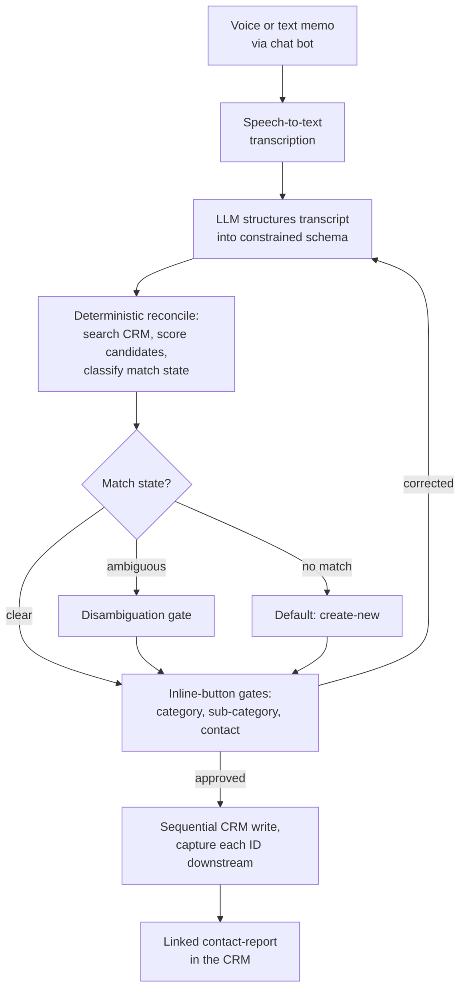
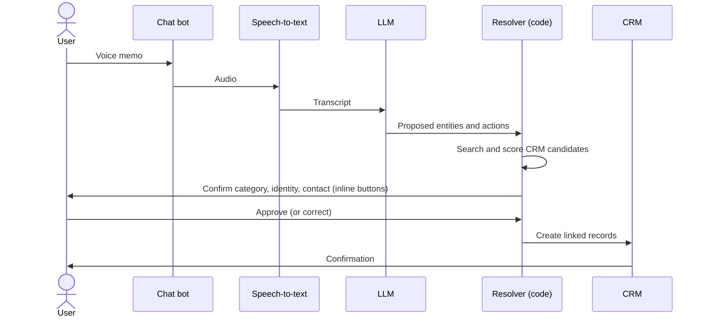

# voice-to-crm-agent

[](https://github.com/felixuniversityca-svg/voice-to-crm-agent/actions/workflows/test.yml)
[](LICENSE)


> A sanitized teaching writeup of a production AI agent I built during a private-equity internship. No proprietary code, credentials, or employer or client data appear here. This explains how the system works and the engineering decisions behind it.

I built an agent that turns a spoken deal update into structured records in a CRM, and writes them, without ever letting the model commit something it merely guessed. The hard problem was never transcription or text generation. It was identity. A post-meeting voice memo is messy, and attaching the right note to the wrong company or person silently corrupts a system of record. The whole design is organized around one rule: the model may read and propose, but it may not guess who someone is.

## Key ideas

- **The model proposes, deterministic code decides identity.** No record is written on a guess.
- **Human-in-the-loop gates** on every irreversible write, surfaced as inline chat buttons.
- **Identity resolution that degrades safely**: generic and geographic tokens are dropped, and weak evidence defaults to creating a new record rather than a wrong attachment.
- **Forced disambiguation** when two records both match, instead of silently picking one.
- **A failure-mode post-mortem** of a real over-matching bug, and the fix.

**Stack:** a workflow orchestrator (n8n), a speech-to-text model, an LLM, a CRM read/write API, and a chat channel whose inline buttons are the human approval surface.

## Architecture: six stages, mirroring how a person processes a memo

The pipeline runs on a workflow orchestrator (n8n) and chains four external services: a speech-to-text model, an LLM, the CRM read/write API, and a chat channel whose inline reply buttons act as the human approval surface.

1. **Capture.** The user sends a voice or text memo to a chat bot. After transcription the two are treated identically.
2. **Transcribe.** A speech-to-text model returns raw text. No cleanup, no "helpful" reinterpretation.
3. **Structure.** An LLM converts the transcript into a constrained schema: which entities were mentioned, what happened, what follow-up actions are implied. The LLM proposes, it does not decide identity.
4. **Reconcile.** Deterministic code searches the CRM for candidate records, scores them, and classifies the situation as a clear match, ambiguous, or no match. This is where most of the engineering lives.
5. **Confirm.** A sequence of inline-button gates asks the human to approve the category, the sub-category, the disambiguation of any contested entity, and the specific contact, before anything is written.
6. **Write.** Once the gates pass, the agent writes to the CRM: it creates the organization, person, deal, and report records in sequence, capturing each new record ID to wire up the next, so the contact-report lands fully linked.



### The human-in-the-loop gate, step by step



## Guardrails, and why each exists

- **Inline-button approval gates (category, sub-category, disambiguation, contact).** Each is a human checkpoint on an irreversible write. They exist because an earlier version wrote the report before identity was confirmed, so a wrong company or a misspelling propagated into every downstream record. Confirming identity before the write contains the blast radius.
- **Multi-entity guard.** A single memo can name several organizations, or several people from one institution. The guard counts distinct entities, never raw mentions, so five contacts from one bank resolve to one organization with five people, not five organizations.
- **"Default to create-new, never guess" resolver rule.** When evidence is weak, the resolver creates a new record rather than attaching to a plausible-looking existing one. A wrong new record is trivially merged later. A wrong attachment silently corrupts an existing record.
- **Reversible, sequential writes.** Records are created in dependency order, each new ID captured before the next call, so a failed run never leaves a half-linked report. Favoring create-new over risky merges keeps every write correctable rather than silently destructive.
- **Retries, timeouts, and a dedicated error workflow.** Every external call (transcription, LLM, CRM, chat) gets retries and timeouts, and a global error workflow catches failures instead of leaving a run partially applied.

## Anti-hallucination and reconciliation design

The core principle: the LLM reads and proposes, but identity is decided by deterministic code against the CRM. Reconciliation tokenizes the entity name, drops generic and geographic tokens (legal-form words, "bank", city names) so they cannot create false matches, and scores the remaining distinctive tokens with fuzzy string matching. Transcription noise degrades safely: a garbled name fails to match and routes to create-new, rather than snapping to the nearest record. The rule the resolver never breaks: **thematic or geographic proximity is not evidence of identity.** Two family offices in the same city and sector are not the same entity. The resolver forces a human gate only when two or more candidates each have a genuine, conflicting match.

## Failure-mode post-mortem: the over-matching bug

A real test exposed two linked failures. First, a memo about a mid-size firm whose name shared a generic token with several CRM records matched all of them, because the search was tokenizing on words like "private" and the legal form. The score crossed the "very similar" threshold, so the confirmation gate did not fire, and the resolver silently picked one sub-record. Second, a memo naming a large institution matched both the parent entity and a subsidiary, and again one was chosen silently. The danger was the combination: a high score plus a suppressed gate equals a confident wrong write.

The fix had two parts. First, token hygiene: a skip-list of generic and geographic tokens, compared accent-insensitively, so only genuinely distinctive tokens drive a match. Second, a forced-disambiguation rule: if two or more candidates clear the threshold with distinct names, the confirmation gate fires regardless of how high the top score is. It was caught by running the pipeline against a suite of messy real-world memos and inspecting the actual execution data, not by reading the code. Reconciliation bugs only show up against real noise.

## Lessons, and what I would do differently

- **Test against real noise early.** The over-matching bug was invisible in code review and obvious the moment real memos ran through it. A messy-input fixture belongs in place before any reconciliation logic is trusted.
- **Push more decisions into deterministic code.** The less the LLM decides, the fewer the surprises. Identity, thresholds, and gating belong in code, not in a prompt.
- **Gates cost latency.** Several confirmation taps are safe but slow. A confidence threshold could auto-approve unambiguous matches and reserve human gates for genuine ambiguity.
- **Add an automated resolver eval.** A labeled set of memo-to-record pairs scored on precision would catch regressions before they reach the CRM, the same way a retrieval eval guards a search system.

## Illustrative code

`resolver_pattern.py` is a small, self-contained version of the reconciliation guardrail described above, generic and free of any proprietary logic or data. It shows the token hygiene, the scoring, the forced-disambiguation rule, and the create-new default.

```bash
python resolver_pattern.py   # run the worked examples
python test_resolver.py      # unit checks for the resolver behaviour
```

## What this demonstrates

The interesting part of an LLM agent that writes to a system of record is not the model. It is everything built around the model to keep it honest: deterministic identity resolution, human gates on every irreversible write, safe degradation under noise, and testing against real messy input rather than the happy path.

## Note on sanitization

This is a teaching writeup of confidential employer work. The production workflow, all credentials and tokens, the CRM schema specifics, model and vendor names, and every real organization, deal, and person have been deliberately omitted or generalized.
